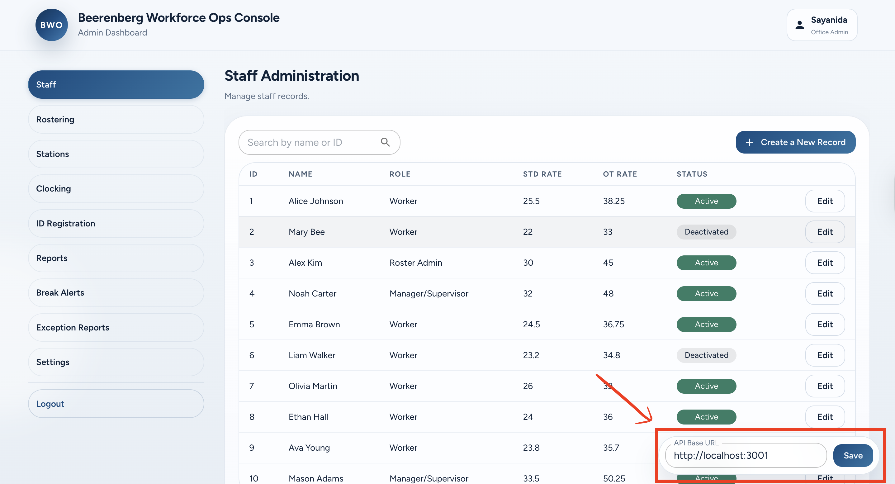

# Beerenberg Workforce Ops Console

**Project:** _HiveOps Admin Console_  
**Version:** 2.0  
**Author:** Saya Yoshida  
**Date:** [1 July 2026]  
**Live Demo:**　https://sayanida.github.io/react-hiveops-admin/

An admin operations console for workforce and attendance management, built with React, TypeScript and Material UI.

Originally developed as part of a university group project.
This repository contains my independently redesigned and extended Admin Portal. I rebuilt the UI, migrated the project to TypeScript, implemented　features from the original requirements, and refactored the architecture into a standalone portfolio project.

---

## Overview

This app provides a role-based admin dashboard for managing staff, rostering, clocking, and operational reporting. It is built as a single-page application with protected routes and tab-level access control per admin role.

### Key highlights

- Designed and implemented all UI components and layouts independently using MUI
- Translated assignment requirements into working features across 9 admin tabs
- Implemented role-based access control — tab visibility changes dynamically per login role
- Used React Query for data fetching with stale-time caching and optimistic mutation patterns
- Structured components with clear separation of concerns (page / tab / shared)

---

## Tech Stack

| Category          | Technology                                               |
| ----------------- | -------------------------------------------------------- |
| UI Framework      | [React](https://react.dev)                            |
| Component Library | [MUI (Material UI)](https://mui.com)                  |
| Build Tool        | [Vite](https://vitejs.dev)                               |
| Language          | TypeScript (TS/TSX)                                      |
| HTTP Client       | [Axios](https://axios-http.com)                          |
| Mock API          | [JSON Server](https://www.npmjs.com/package/json-server) |

### TypeScript migration status

- The Admin app has been migrated from JS/JSX to TS/TSX.
- Core app pages, tabs, shared UI primitives, auth, and role navigation now use TypeScript.
- Old JS/JSX duplicates used during migration have been removed.

---

## Features

| Tab               | Description                                                        |
| ----------------- | ------------------------------------------------------------------ |
| Staff             | Staff records — register, edit, view profiles and contract details |
| Rostering         | Weekly roster management — assign shifts by staff and station      |
| Stations          | Workstation configuration and assignment                           |
| Clocking          | Attendance log monitoring — view and approve amendment requests    |
| ID Registration   | Biometric / ID card registration management                        |
| Reports           | Attendance and pay reporting with period filters and CSV export    |
| Break Alerts      | Real-time break monitoring and alert management                    |
| Exception Reports | Flag and review attendance anomalies                               |
| Settings          | System configuration                                               |

### Role-based access

Login role determines which tabs are visible:

| Role                 | Accessible Tabs                                       |
| -------------------- | ----------------------------------------------------- |
| Office Admin         | All tabs                                              |
| Manager / Supervisor | Stations, Clocking, Reports, Break Alerts, Exceptions |
| Roster Admin         | Rostering only                                        |

---

## Getting Started
Try the live demo:
https://sayanida.github.io/react-hiveops-admin/

or following below steps:

### Prerequisites

- [Node.js v20+](https://nodejs.org) — check with `node -v`
- [nvm](https://github.com/nvm-sh/nvm) (recommended)

### Install and run

```bash
nvm use 20
npm install
npm run dev
```

App runs at **http://localhost:5173** — navigate to `/admin` to start.

---

## Mock Login Credentials

| Email                     | Password      | Role         |
| ------------------------- | ------------- | ------------ |
| `admin@beerenberg.com.au` | `password123` | Office Admin |
| `frodo@farm.com`          | `password123` | Manager      |
| `samwise@farm.com`        | `password123` | Roster Admin |

---

## Mock API (JSON Server)

```bash
npx json-server --watch db.json --routes routes.json --port 3001
```

After starting the mock API:

1. Open the Admin screen.
2. In the API Base URL input at the bottom-right, enter `http://localhost:3001`.
3. Click Save.



Files:

- `db.json` — mock data source
- `routes.json` — URL rewrite rules

---

## Project Structure

```
src/
├── main.tsx                   # App entry point + routing
├── theme.ts                   # MUI theme configuration
├── access/
│   └── uiRoleNavigation.ts    # Role-to-tab access control
├── auth/
│   ├── AuthContext.tsx        # Auth state provider
│   ├── authStorage.ts         # Session persistence
│   └── roleAccess.ts          # Role constants and helpers
├── components/
│   ├── admin/
│   │   ├── AdminSidebar.tsx
│   │   └── AdminTopbar.tsx
│   └── common/
│       ├── ApiConfigBar.tsx
│       └── Toast.tsx
├── hooks/
│   └── useToast.ts
├── mocks/
│   └── staffAdminMockData.ts
├── pages/
│   ├── Admin.tsx              # Admin dashboard entry
│   ├── Login.tsx
│   └── Unauthorized.tsx
├── tabs/
│   ├── shared.tsx             # Shared UI components
│   ├── StaffTab.tsx
│   ├── RosterTab.tsx
│   ├── StationsTab.tsx
│   ├── ClockingTab.tsx
│   ├── RegistrationsTab.tsx
│   ├── ReportsTab.tsx
│   ├── BreakAlertsTab.tsx
│   ├── ExceptionsTab.tsx
│   └── SettingsTab.tsx
└── utils/
    └── api.ts
```

---

## Original Requirements

The following user stories were specified in the project's Business Analyst working document. Only stories relevant to the Admin Portal are listed here.

### E-01 — Staff Administration

**US-00 · Manage system user accounts**

> As an Office Admin, I want to create system user accounts and assign roles, so that each staff member can only access the functions relevant to their role.

- Given I create an account and assign a role (Office Admin / Roster Admin / Manager / Worker), then that staff member logs in with permissions for their role only
- Given a staff member is assigned the Worker role, then they cannot access the Admin Portal
- Given a staff member is assigned the Roster Admin role, then they can only access roster management for their assigned team or site
- Given a staff member is assigned the Manager/Supervisor role, then they can access approvals, exception reports, and supervisor assistance
- Given a staff member is assigned the Office Admin role, then they have full access to all system functions
- Given a staff member enters incorrect credentials, then the system shows an error and does not grant access
- Given a staff member logs out, then their session is ended and they are redirected to the login page

---

**US-01 · Create a staff record**

> As an Office Admin, I want to create a staff record with ID, name, contract type, role, standard hours, and pay rates, so that the system has accurate information to classify time and calculate wages.

- Given I fill in all required fields (ID, name, contract type, role, standard hours, standard rate, overtime rate) and submit, then the record is saved and appears in the staff list
- Given I leave a required field empty and submit, then the system displays a validation error on that field
- Given a staff ID already exists, when I try to save a duplicate, then the system rejects it with an error message

---

**US-02 · Configure standard hours and overtime rules**

> As an Office Admin, I want to configure standard hours as either a weekly total or patterned schedule and set overtime thresholds, so that the system can correctly classify overtime and penalty time.

- Given a fresh system, when I navigate to Admin Portal > Settings, then default overtime rules are pre-set to 8h/day and 38h/week
- Given I select weekly total and enter "20 hours", then the system uses 20h as the standard week baseline
- Given I select patterned hours and enter "Mon–Fri 9–5", then the system uses this pattern as the standard schedule
- Given a worker's hours exceed 8h/day or 38h/week, then those hours are classified as overtime
- Given penalty flags are configured, when a worker clocks in on a Saturday/Sunday/public holiday, then those hours are flagged with the appropriate penalty
- Given I am logged in as Office Admin, when I navigate to Settings, then I can configure system-wide overtime thresholds and penalty flags that apply to all staff

---

**US-03 · Edit a staff record**

> As an Office Admin, I want to edit an existing staff record, so that I can keep staff information up to date.

- Given a staff record exists, when I update any field and save, then the change is reflected in the staff list
- Given I clear a required field and try to save, then the system shows a validation error
- Given I update a pay rate, then the new rate applies to future calculations only; historical records are unchanged
- Given I deactivate a staff member's record, then all associated identification methods are automatically deactivated and the worker can no longer clock in at any station

---

### E-02 — Roster Management

**US-04 · Create a roster entry**

> As an Office Admin or Roster Admin, I want to assign a staff member to a date with a start time and number of hours, so that the system knows who is expected to work and when.

- Given I select a staff member, date, start time, and hours and save, then the roster entry is created and visible in the roster view
- Given I am a Roster Admin, then I can only create roster entries for my assigned team/site
- Given I leave a required field empty and submit, then the system shows a validation error
- Given a staff member is already rostered for the same date and time, when I save, then the system warns me of the conflict

---

**US-05 · View roster**

> As an Office Admin or Roster Admin, I want to view the roster for a given date range, so that I can see who is scheduled to work.

- Given roster entries exist, when I select a date range, then all staff assigned to that period are shown with their start time and hours
- Given no roster entries exist for the selected dates, then a message is shown indicating no staff are rostered

---

### E-03a — Clock Station Setup

**US-07 · Set up a clock station**

> As an Office Admin, I want to set up a clock station with a name, location, and type, so that the system knows where devices are deployed.

- Given I enter a station name, location, and type and save, then the station appears in the station list
- Given I leave a required field empty and submit, then the system shows a validation error

---

### E-03b — Identification Registration

**US-08 · Register identification method to staff record**

> As an Office Admin, I want to register a simulated identification method (webcam face mock / QR / PIN) to a staff record, so that the system can verify worker identity at the time station.

- Given a staff record exists, when I register an identification method and save, then it is linked to the staff member and they can use it to identify themselves at any station
- Given a staff member already has a registered method, when I select re-register and save, then the previous registration is immediately deactivated and the new method is linked
- Given a staff member needs temporary access (e.g. lost card), when I issue a temporary PIN, then: the PIN is valid for 72 hours; the worker can use it at any station during that period; all uses are recorded in the audit log

---

### E-04 — Clock In / Out (Admin)

**US-12 · Manual clock in/out via Admin Portal**

> As an Office Admin, I want to manually clock in or out a staff member via the Admin Portal, so that I can assist when a worker is unable to clock in or out themselves.

- Given I select a staff member, choose clock in or out, enter a reason, and confirm, then the clock event is saved and the audit log records the manual entry flag, my Office Admin ID, timestamp, and reason
- Given I try to save without entering a reason, then the system shows a validation error
- Given the clock-in/out is saved, then it is stored as a pending amendment requiring Manager/Supervisor approval before it flows into the time information report or fortnightly CSV export

---

### E-05 — Break Management (Admin)

**US-15 · Configure break reason paid/unpaid status**

> As an Office Admin, I want to configure each break reason as paid or unpaid in Admin Portal > Settings, so that the system correctly excludes unpaid break time from hours worked calculations.

- Given I navigate to Admin Portal > Settings > Break Reasons, then I can see all predefined reasons (Meal, Rest, Personal, Emergency, Other) each with a paid/unpaid toggle
- Given I set a break reason to unpaid and save, then any break logged under that reason is excluded from the worker's total hours worked
- Given I set a break reason to paid and save, then any break logged under that reason is included in the worker's total hours worked
- Given I try to save a break reason without selecting paid or unpaid, then the system shows a validation error
- Given I update a break reason configuration, then the change applies to future break records only; existing records are unchanged

---

### E-06 — Clock Record Amendments

**US-16 · Amend a clock record**

> As an Office Admin or Manager/Supervisor, I want to add, edit, or delete a clock event with an audit trail, so that errors can be corrected transparently.

- Given a clock record exists, when I add, edit, or delete a clock event and enter a reason, then the amendment is saved and the audit log records the action type, original value, new value, my ID, timestamp, and reason
- Given I try to save an amendment without a reason, then the system shows a validation error
- Given an Office Admin submits an amendment, then it is routed to a Manager/Supervisor for approval; an Office Admin cannot approve their own amendment
- Given a Manager/Supervisor submits an amendment, then it is routed to an Office Admin for approval; a Manager/Supervisor cannot approve their own amendment
- Given the approver approves the amendment, then the clock record is updated and the approval is recorded in the audit log
- Given the approver rejects the amendment, then the clock record remains unchanged and the rejection is recorded with the approver's ID and reason

---

### E-08a — Live Exception Alerts

**US-17 · Flag missed clock out**

> As an Office Admin or Manager/Supervisor, I want the system to flag staff who clocked in but did not clock out, so that I can investigate and correct the record.

- Given a staff member clocked in but has no clock-out record at end of day, then they appear in the exception report with clock-in time and station
- Given an Office Admin or Manager/Supervisor corrects the missing clock-out via an approved amendment, then the system removes the exception from the exception dashboard

---

**US-18 · Alert for approaching break threshold**

> As a Manager/Supervisor, I want to be alerted when a worker is approaching 5 hours without a meal break, so that I can follow up with the worker directly.

- Given a worker has been clocked in for approaching 5 hours with no break logged, then a real-time alert appears on the Manager/Supervisor and Office Admin dashboard
- Given the alert appears, when the worker subsequently logs a break, then the alert is cleared from the dashboard
- Given the worker reaches 5 hours without a break, then they are included in the end-of-day exception email

---

**US-19 · Flag unrostered clock-in**

> As a Manager/Supervisor, I want to be notified when a worker attempts to clock in without a roster entry, so that I can investigate potential time fraud.

- Given an unrostered clock-in exception is flagged, then a real-time alert appears on the Manager/Supervisor and Office Admin dashboard
- Given an unrostered clock-in alert appears on the exception dashboard, when I review it, then I can either add a roster entry to retrospectively approve the clock-in, or acknowledge the exception by entering a reason; the exception is then marked as resolved with my ID, timestamp, and reason recorded in the audit log
- Given the worker reaches end of day with an unresolved unrostered clock-in exception, then they are included in the end-of-day exception email

---

### E-04 — Clock Station Policy

**US-11 · Configure station clock-in/out policy**

> As an Office Admin, I want to configure station clock-in/out policies, so that the Farm can enforce or relax rules around station usage and unrostered clock-ins based on operational needs.

- Given the station policy is set to warn, then the system warns but still allows a worker to use the same station for clock-in and clock-out
- Given the policy is set to enforce, then the system blocks a worker from clocking out at the same station they clocked in at
- Given the unrostered clock-in policy is switched to block, then the system prevents any worker from clocking in without a roster entry
- Given I save a change to the station policy, then the new policy applies to all clock events from that point forward; existing records are not affected
